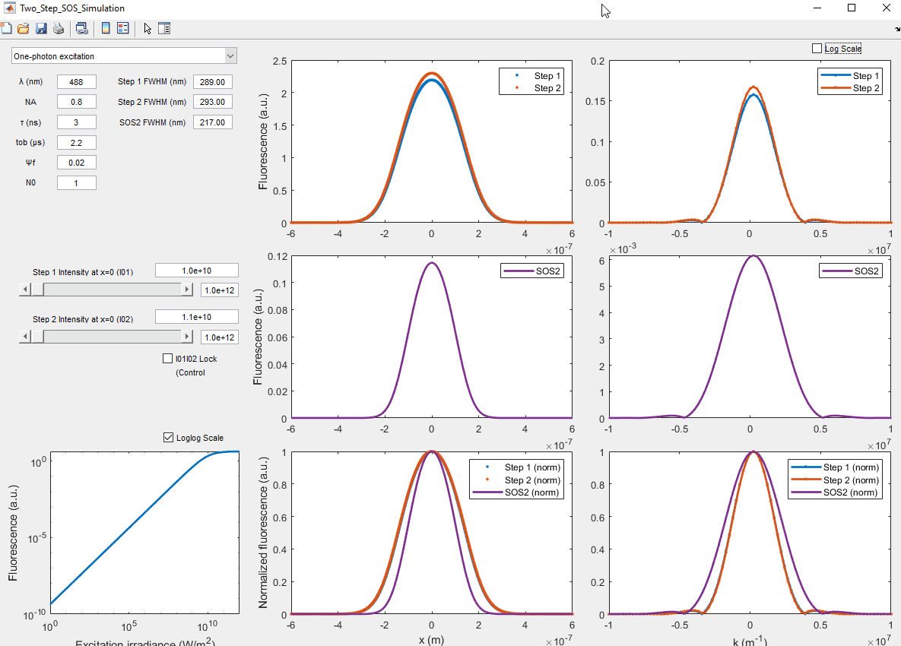

# Two-step stepwise optical saturation (SOS) simulation

This is the repository of a Matlab GUI program that can replicate the simulation, i.e., Figs. 11 and 12,  performed in the following publication:

- [Y. Zhang et al., “Super-resolution fluorescence microscopy by stepwise optical saturation,” Biomed. Opt. Express, vol. 9, no. 4, p. 1613, Apr. 2018.](https://www.osapublishing.org/abstract.cfm?URI=boe-9-4-1613)
```latex
@article{Zhang2018,
  author = {Zhang, Yide and Nallathamby, Prakash D. and Vigil, Genevieve D. and Khan, Aamir Ahmed and Mason, Devon E. and Boerckel, Joel D. and Roeder, Ryan K. and Howard, Scott S.},
  journal = {Biomedical Optics Express},
  month = {apr},
  number = {4},
  pages = {1613},
  title = {{Super-resolution fluorescence microscopy by stepwise optical saturation}},
  url = {https://www.osapublishing.org/abstract.cfm?URI=boe-9-4-1613},
  volume = {9},
  year = {2018}
}
```

## Installation
- Install [Matlab](https://www.mathworks.com/products/matlab.html) on your computer
- Clone this repository:
```
git clone https://github.com/yzhang34/two-step-SOS-sim.git
```
- Run the file 'Two_Step_SOS_Simulation.m' with Matlab

## Example


## License & Copyright
© 2019 Yide Zhang, University of Notre Dame

Licensed under the [Apache License 2.0](LICENSE)
